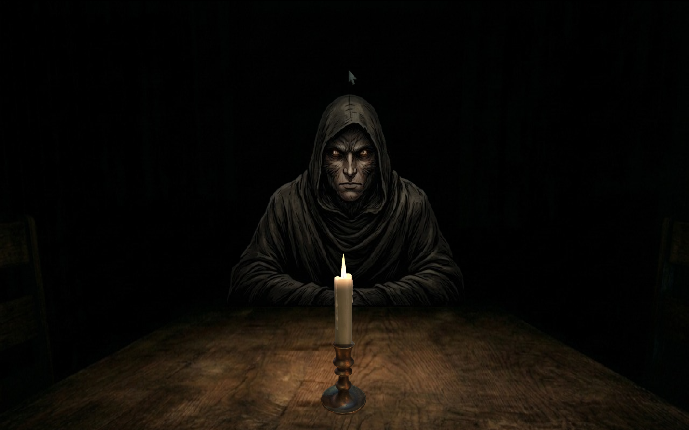
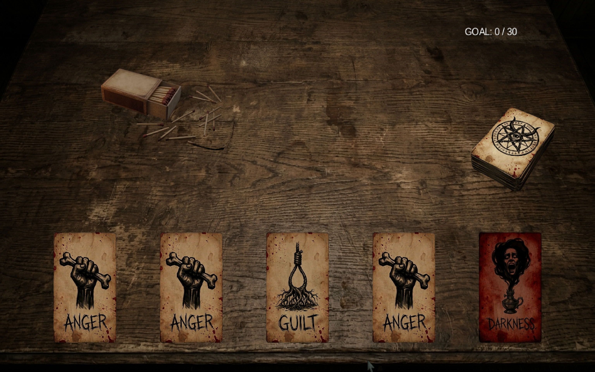

# Discardia

A 2D psychological horror card game built with Java and LibGDX.





## Download & Play

Go to the [**Releases**](../../releases/latest) page and download the file for your system:

| System | File | Steps |
|--------|------|-------|
| **Windows** | `Discardia-windows.zip` | 1. Extract the zip<br>2. Double-click `Discardia.exe` |
| **Linux** | `Discardia-linux.zip` | 1. Extract the zip<br>2. Run `./Discardia` in terminal |
| **macOS** | `Discardia-macos.zip` | 1. Extract the zip<br>2. Run `./Discardia` in terminal |

> No Java installation required — it's bundled inside.

**macOS note:** If you see *"cannot be opened because the developer cannot be verified"*, right-click the file → Open → Open anyway.

---

## About

Discardia is a single-player card game set in a dark, atmospheric environment. You play cards representing negative emotions — Fear, Anger, Anxiety, Depression, and others — while managing candles that keep an entity at bay. Special cards can alter the rules of the game in unexpected ways.

## Gameplay

- Draw and play emotion cards from your deck
- Keep your candles lit to hold off the entity
- Special cards (Blessing, Curse, Darkness, Hallucination, Time) introduce unpredictable twists
- Survive until the deck runs out to win

---

## For Developers

### Run from source

```bash
./gradlew lwjgl3:run
```

### Build fat JAR

```bash
./gradlew lwjgl3:jar
```

### Project Structure

```
core/       - Game logic, cards, entities, screens
lwjgl3/     - Desktop launcher
assets/     - Textures, sounds, fonts
```

### Design Patterns Used

Observer, Visitor, Composite, Generics, Serialization, Reflection, Annotations, Threads
